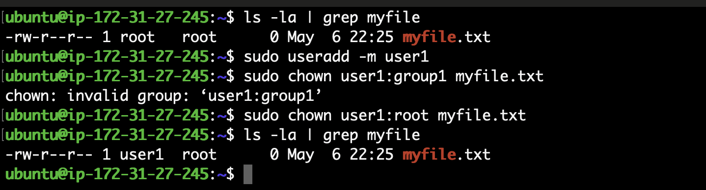
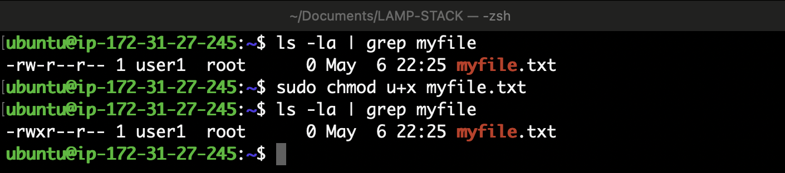

# File Ownership and Permissions in Linux

## Ownership

In Linux, each file and directory is associated with an owner and a group. The owner is typically the user who created the file, while the group is a collection of users who share access permissions to the file. 

### `chown` Command

The `chown` command is used to change the owner and group of a file or directory in Linux. Its syntax is:


- `OWNER`: Specifies the new owner of the file.
- `GROUP`: Optionally specifies a new group for the file. If not provided, the group remains unchanged.
- `FILE`: Specifies the file or directory whose ownership is to be changed.  

```
Sudo chown <username>:<group> <filename>  

```

Example:  

  


## Permissions

Linux file systems use a permission system to control access to files and directories. There are three types of permissions: read (`r`), write (`w`), and execute (`x`). Permissions are set for three categories of users: the owner of the file, the group associated with the file, and all other users.

### `chmod` Command

The `chmod` command is used to change the permissions of a file or directory in Linux. Its syntax is:  


- `MODE`: Specifies the new permissions for the file. It can be represented symbolically (e.g., `u+x` for adding execute permission for the owner) or numerically (e.g., `755` for giving read, write, and execute permissions to the owner, and read and execute permissions to the group and others).
- `FILE`: Specifies the file or directory whose permissions are to be changed.  
```
sudo chmod u+x <filename>
```

Example:  

  


## Access Control

Access to files and directories in Linux is determined by a combination of ownership and permissions:

- **Owner**: The owner of a file has full control over it, including the ability to read, write, and execute it.
- **Group**: Members of the group associated with the file have permissions as defined by the group's permissions.
- **Others**: All other users have permissions as defined by the "others" category.

### Permission Levels

Each file has three sets of permissions:

- **Owner Permissions**: Apply to the owner of the file.
- **Group Permissions**: Apply to the group associated with the file.
- **Other Permissions**: Apply to all other users.

Permissions can be set separately for each of these levels, allowing for fine-grained control over file access.

## Conclusion

Understanding ownership and permissions in Linux is crucial for managing file access and security. The `chown` and `chmod` commands provide powerful tools for changing ownership and permissions, ensuring that files are accessible only to authorized users and groups.


